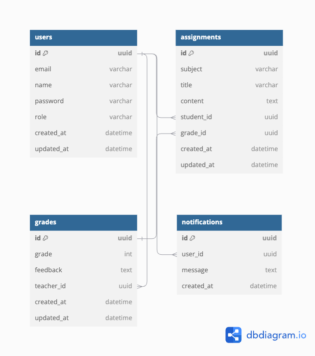

# System Architecture Overview

The application is built with a Frontend using Next.js, Zustand, Apisauce, Shadcn, and React Hook Form, while the Backend leverages NestJS with Prisma for database interaction. Below is a description of the architecture and design decisions.

## Frontend Architecture:

1. Next.js: Used for better SEO and performance, especially for pages with dynamic content like user dashboards and forms.

2. Apisauce: Ensures consistency and easier management of HTTP requests, especially for error handling and response transformations.

3. Zustand: Chosen for its simplicity and minimalistic API. Zustand helps in managing global state efficiently.

4. Shadcn: Used for building responsive and accessible UI components in a consistent manner, reducing development time and effort.

5. React Hook Form: Provides an easy way to handle forms with validation and submission while minimizing re-renders.

## Backend Architecture

1. NestJS: NestJS leverages TypeScript and provides decorators for cleaner code. It follows a modular architecture, ensuring maintainability and scalability in the long term. It supports middleware, guards, and interceptors to handle validation, and authorization.

2. Prisma: Chosen for its strong TypeScript support, ease of use, and automatic migrations. Prisma generates type-safe queries that are easier to use and less error-prone, making database interactions more efficient.

## Entity Relationship Diagram

